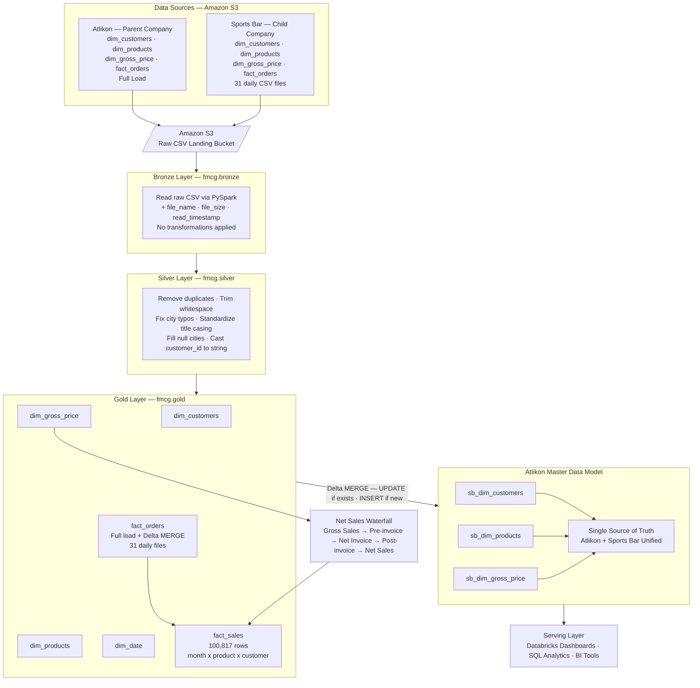

# Databricks-FMCG

# databricks-fmcg-lakehouse

A production-grade data lakehouse pipeline built on Databricks that migrates Sports Bar (child company) data into Atlikon's (parent company) master data model — creating a single source of truth across both companies for customers, products, pricing, and sales.

---

## Project Overview

Atlikon acquired Sports Bar. Both companies had their own data models, their own customers, their own products, their own sales numbers. The business needed one answer to every revenue question.

This pipeline unifies both companies into a single lakehouse on Databricks using the Medallion Architecture — Bronze → Silver → Gold — with daily incremental updates via Delta MERGE.

**End result:** 6 unified Gold tables covering customers, products, pricing, dates, orders, and net sales across both companies.

---

## Architecture Diagram



---

## Tech Stack

| Layer | Technology |
|---|---|
| Cloud Storage | Amazon S3 |
| Platform | Databricks |
| Catalog | Unity Catalog |
| Processing | PySpark |
| File Format | Delta Lake |
| Orchestration | Lakeflow Jobs |
| Pattern | Medallion Architecture |
| Language | Python / SQL |

---

## Pipeline Walkthrough

### Step 1 — Setup

Three notebooks run once before any processing:

- Creates the `fmcg` catalog with `bronze`, `silver`, and `gold` schemas in Unity Catalog
- Defines shared utility variables reused across all notebooks
- Builds a `dim_date` table for time-based analysis

### Step 2 — Bronze Layer

Raw CSV files are read from Amazon S3 using PySpark and written to Delta tables with three metadata columns added to every row:

- `file_name` — source file for lineage tracking
- `file_size` — size of the ingested file
- `read_timestamp` — exact time the row was ingested

No transformations are applied. The raw data is preserved exactly as received.

### Step 3 — Silver Layer

Data is cleaned and standardized. For `dim_customers`, six transformations run:

1. Remove duplicates
2. Trim whitespace from all string columns
3. Fix city name typos
4. Standardize to title casing
5. Fill null cities (confirmed valid by the business team)
6. Cast `customer_id` to string

The same cleaning logic applies to `dim_products` and `dim_gross_price`.

### Step 4 — Gold Layer

Business-relevant columns are selected and business attributes are added — market, platform, and channel. The Gold layer produces six tables:

| Table | Description |
|---|---|
| `dim_customers` | Cleaned, deduplicated customer master |
| `dim_products` | Standardized product catalogue |
| `dim_gross_price` | Pricing by product code and fiscal year |
| `dim_date` | Date dimension for time-based analysis |
| `fact_orders` | Full historical load + 31-day Delta MERGE |
| `fact_sales` | 100,817 rows at month × product × customer grain |

### Step 5 — Net Sales Calculation

`fact_sales` is built by joining `fact_orders` with `dim_gross_price` on product code and fiscal year, then applying the standard FMCG value waterfall:

```
Gross Sales
− Pre-invoice deductions
= Net Invoice Sales
− Post-invoice deductions
= Net Sales
```

### Step 6 — Incremental Load

Sports Bar drops one order file per day into S3 throughout December 2025 — 31 files total. Each file is merged into `fact_orders` using Delta MERGE:

- **Match found** → UPDATE the existing record
- **No match** → INSERT as a new record

This ensures no duplicates, no data loss, and no full reloads.

### Step 7 — Parent Company Integration

After each Gold table is built for Sports Bar, a Delta MERGE pushes the data into Atlikon's master dimension tables:

- `sb_dim_customers`
- `sb_dim_products`
- `sb_dim_gross_price`

Both companies are now reflected in the parent Gold layer — always current, always consistent.

---

## Key Numbers

| Metric | Value |
|---|---|
| Companies unified | 2 |
| Gold tables | 6 |
| Daily incremental files | 31 |
| Rows in fact_sales | 100,817 |
| Net sales YoY growth | 141% |

---

## Project Structure

```
databricks-fmcg-lakehouse/
│
├── setup/
│   ├── 0_create_catalog_schemas.py
│   ├── 1_shared_variables.py
│   └── 2_dim_date.py
│
├── dimensions/
│   ├── 1_customer_data_processing.py
│   ├── 2_product_data_processing.py
│   └── 3_pricing_data_processing.py
│
├── facts/
│   ├── 1_fact_orders_full_load.py
│   ├── 2_fact_orders_incremental.py
│   └── 3_build_fact_sales_net_sales.py
│
└── merge/
    ├── merge_customers_to_parent.py
    ├── merge_products_to_parent.py
    └── merge_pricing_to_parent.py
```

---

## Author

**Pranitha Seemalamudi**  
[LinkedIn](https://www.linkedin.com/in/pranithaseelamudi)
